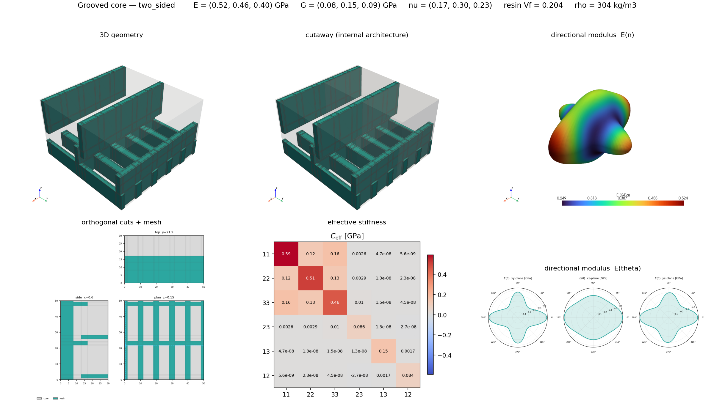
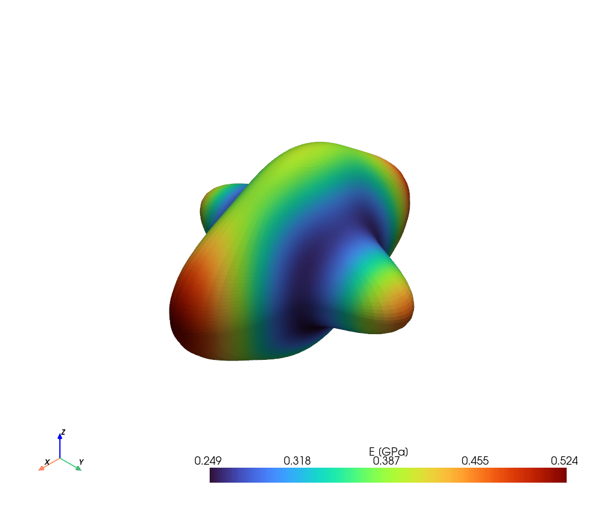
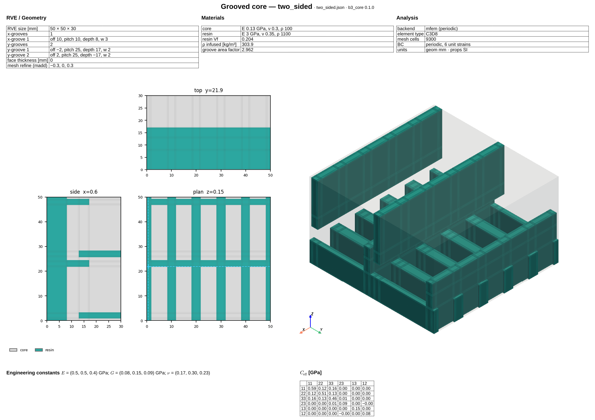
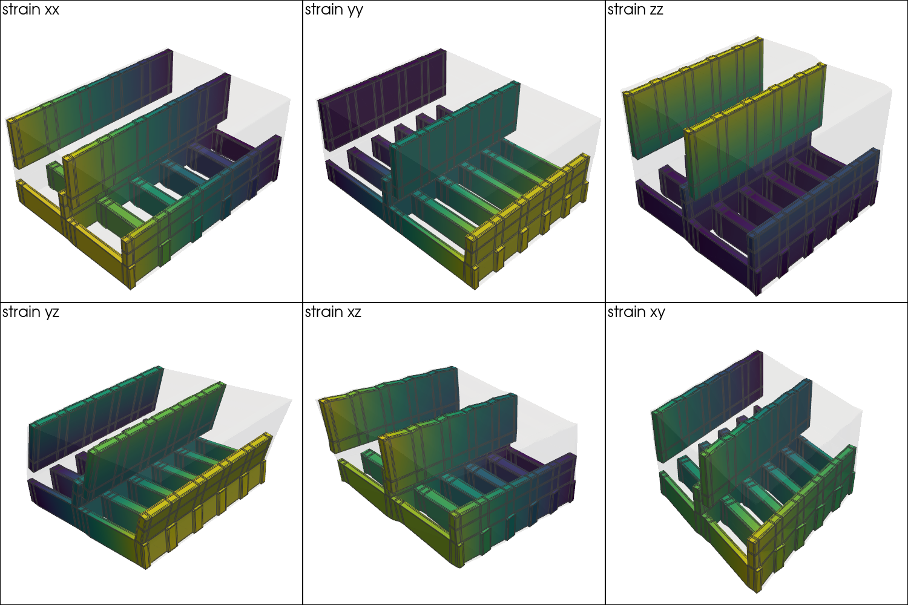
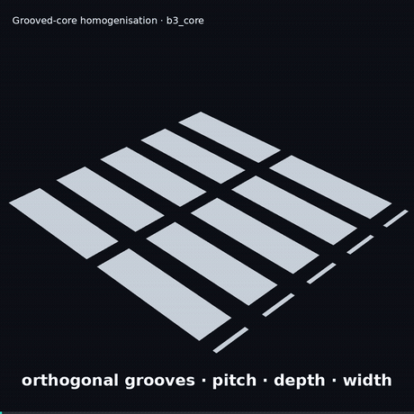

# b3_core

Homogenized elastic properties for sandwich-panel cores with sawcuts and
machined grooves. The cuts fill with resin during infusion, altering the
effective stiffness and density of the core; this package predicts the
resulting orthotropic material and returns it as a `b3_mat.OrthotropicMaterial`
so it drops into the wider b3 section / beam pipeline.

## Approach

Structured 3D RVE mesh (PyVista) with cell-level tagging of core vs.
resin-filled groove. Six periodic-BC load cases (εxx, εyy, εzz, εxy, εxz, εyz)
run in parallel and the averaged reactions give the effective engineering
constants (Ex/Ey/Ez, Gxy/Gxz/Gyz, Poisson ratios) and infused density. Grooves
can be tapered by mould curvature (`kx`, `ky`) for curved panels.

Backends: **MFEM** (default; installed as standard), **CalculiX**, plus optional
**FEniCSx** and **numpy**; set `"validate_with_ccx": true` to cross-check a
backend against CalculiX.

## Agent skill

Repo-root [`SKILL.md`](SKILL.md) is the source of truth for LLM agents. The same
file is packaged under `b3_core` for installed use:

```bash
b3_core skill              # path to packaged SKILL.md
b3_core skill --stdout     # dump the full skill text
```

```python
from b3_core.skill import read_skill, skill_path
```

## Requirements

- Python ≥ 3.11, `uv`
- PyMFEM (`mfem` extra; default backend)
- CalculiX (`ccx`) + `frd2vtu` on PATH if using `backend: ccx` or `validate_with_ccx`
- `treeparse`, `b3_mat` (resolved via `pyproject.toml`)
- `typst` on PATH (only for `b3_core viz datasheet`)

```bash
uv sync --extra mfem   # default backend + optional extras
```

## CLI

Homogenisation runs from a YAML or JSON case file:

```bash
uv run b3_core run examples/simple.yaml
uv run b3_core examples/simple.json              # same (run is the default)
uv run b3_core sweep homogenise                  # parametric study
```

Each run writes `run<HASH>.json` with the engineering constants, geometry
metrics, and (optionally) a backend-vs-ccx comparison.

Optional figures and reports live under `b3_core viz` (not required for FEA
handoff). See `b3_core --help` and `b3_core viz --help`.

## Python API

```python
from b3_core import homogenize

# json_data is a path to a CpropInput JSON file (or an equivalent dict)
result = homogenize("examples/simple.json")
print(result.material)                  # b3_mat.OrthotropicMaterial
print(result.resin_volume_fraction, result.surface_area_factor)
```

`homogenize` wraps the lower-level `cprop` pipeline; call `cprop(...)` directly
for the full raw output dict.

See `examples/curved_panel/` and `examples/mfem_patterns/` for focused demos.
For a unified parametric study (thickness, curvature, groove patterns) with
response curves and gallery renders, see `examples/param_sweeps/`:

```bash
b3_core sweep homogenise --root examples/param_sweeps
# or: make sweep
```

Response curves, gallery renders, and GIFs: `examples/offline/` (not mainline).

## Visualization (`b3_core viz`)

`b3_core.viz` is a unified, high-level layer that makes a grooved-core design
understandable at a glance — geometry, phases, the FE mesh, orthogonal slices,
periodic deformation, and the homogenised stiffness tensor — for both
publication figures and interactive exploration. `GroovedCoreView` is the
one-call entry point; `CoreScene` is a fluent pyvista builder; `CoreModel`
caches the mesh + MFEM homogenisation; `CoreTheme` is the shared styling.

```python
from b3_core.viz import GroovedCoreView

view = GroovedCoreView.from_json("examples/mfem_patterns/two_sided.json")
view.gallery("board.png")                 # composite publication board
view.modulus_surface_png("modulus.png")   # directional Young's modulus E(n)
view.show()                               # native interactive window
view.serve("core.html")                   # interactive HTML viewer ([interactive] extra)
```

```bash
uv run b3_core viz view examples/mfem_patterns/two_sided.json --what gallery -o board.png
uv run b3_core viz halo examples/diab_gs30_scored.json -o examples/img
```

The composite board — 3D geometry, an internal-architecture cutaway, the
directional modulus **surface** `E(n)` (it bulges along stiff directions), the
orthogonal cuts with the mesh, the signed 6×6 `C_eff` heatmap and the polar
`E(θ)` plots:



The directional Young's-modulus surface alone — the clearest single view of the
effective anisotropy:



## Datasheet

`b3_core viz datasheet` renders a one-page report of a case — RVE/geometry, materials
and analysis settings, the internal groove structure with the mesh (plan + side
cross-sections), a 3D isometric of the resin-filled grooves, and the homogenised
engineering constants + 6×6 effective stiffness (via the MFEM backend). Needs the
[`typst`](https://typst.app) binary on PATH.

```bash
uv run b3_core viz datasheet examples/mfem_patterns/two_sided.json -o card.pdf --png card.png
```

```python
from b3_core.datasheet import generate
generate("examples/mfem_patterns/two_sided.json", "card.pdf", out_png="card.png")
```



## Periodic deformation modes

Separate from the datasheet, `b3_core viz deformed` warps the RVE by the true
periodic displacement `u = E·x + w` for each of the six unit-strain load cases
(xx, yy, zz, yz, xz, xy) and renders a 2×3 montage — resin grooves coloured by
displacement magnitude, core translucent. Because the fluctuation `w` is
periodic, opposite faces deform compatibly (the visual check on the periodic BC).

```bash
uv run b3_core viz deformed examples/mfem_patterns/two_sided.json -o modes.png --warp 0.3
```



## Offline scripts

Optional workflows (GIF export, explainer MP4, scratch viz, interactive HTML) live
under [`examples/offline/`](examples/offline/README.md) — not part of `make` or
the main `b3_core` subcommands. Example explainer animation:

```bash
uv sync --extra anim
uv run python examples/offline/explainer.py examples/mfem_patterns/two_sided.json
```

```python
from b3_core.viz.animate import render_explainer
render_explainer("examples/mfem_patterns/two_sided.json", "explainer.mp4", gif=True)
```



## License

MIT
