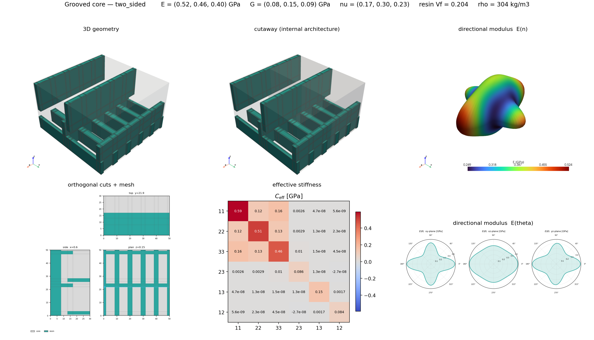
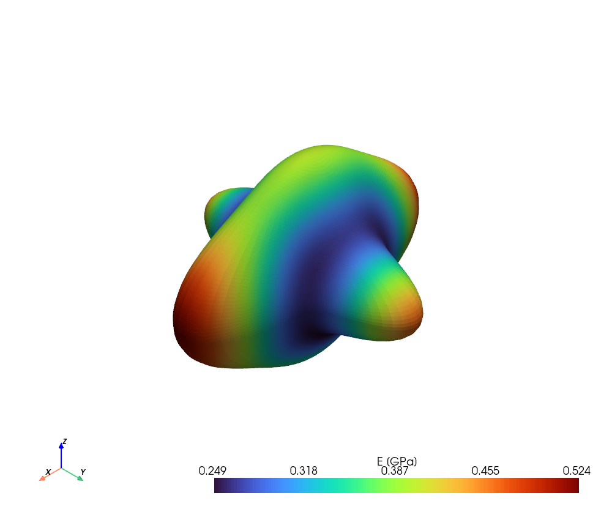
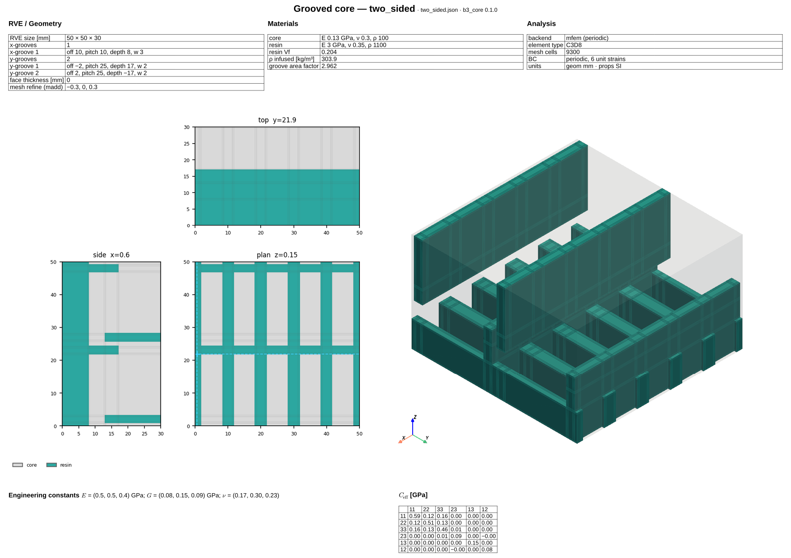
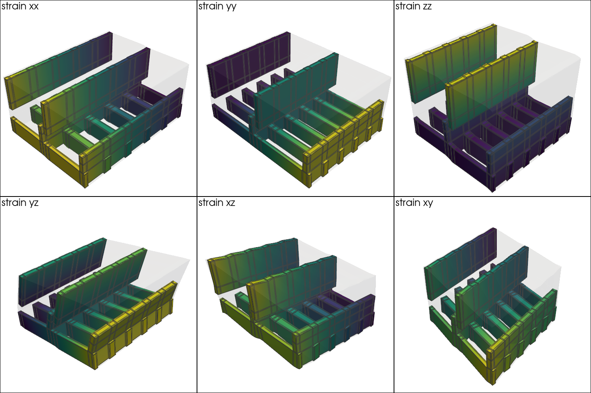

# b3_core

[](https://github.com/wr1/b3_core/actions/workflows/ci.yml)
[](https://github.com/wr1/b3_core/actions/workflows/release.yml)
[](https://wr1.github.io/b3_core/)
[](https://github.com/wr1/b3_core/actions/workflows/ci.yml)
[](https://github.com/wr1/b3_core/releases)
[](https://www.python.org/downloads/)
[](https://github.com/astral-sh/ruff)
[](LICENSE)
[](https://wr1.github.io/b3_core/)

Homogenized elastic properties for **sandwich-panel cores** with sawcuts and
machined grooves. Cuts fill with resin during infusion; this package predicts
the effective orthotropic material and returns a `b3_mat.OrthotropicMaterial`
for the wider b3 section / beam pipeline.

**Docs:** [https://wr1.github.io/b3_core/](https://wr1.github.io/b3_core/) ·
[Getting started](https://wr1.github.io/b3_core/docs/guides/getting-started/) ·
[Resin halo](https://wr1.github.io/b3_core/docs/concepts/resin-halo/) ·
[Agent use](https://wr1.github.io/b3_core/docs/guides/agent-use/)

## Aims

1. **Curvature-dependent infused cores** — kerfs open/pinch on a curved mould, so
   stiffness and mass depend on local κ.
2. **Model those properties** — periodic-BC RVE homogenization, `hw(z)` kerf
   taper, optional resin halo, FEA-ready orthotropic cards.
3. **Lightweight surrogates** — map a **vector of curvatures** (and halo width)
   to stiffness/mass for panel FEA without re-homogenizing every station.

```
scored core + local κ  →  homogenize  →  (E, G, ν, ρ)
                              ↓
                     physics / grid surrogate
                              ↓
              κ(s)  →  mass lookup  →  FEA property field
```

## Quick start (textile-as-code)

Prefer building the RVE in **Python** (factories / `CpropInput`). JSON/YAML are
optional interchange for the CLI and frozen fixtures.

```bash
uv sync --extra dev
```

```python
from b3_core import (
    curved_panel,
    grid_scored,
    homogenize,
    plain,
    uniaxial,
)

r = homogenize(plain())
r = homogenize(uniaxial(depth=8, pitch=10))
r = homogenize(grid_scored(cell_size=0.6), kx=-0.008)  # bottom mouth opens
r = homogenize(curved_panel(thickness=30, ligament=3, kx=0.012).with_halo(0.6))
# r.kerfs: curvature applied as kerf taper (root vs mouth half-width)

print(r.material)  # b3_mat.OrthotropicMaterial (Ex, Ey, Ez, Gij, ν, ρ)
print(r.resin_volume_fraction, r.surface_area_factor)
```

```bash
uv run python examples/textile_grid_scored.py
# optional JSON snapshot for CLI:
#   grid_scored().to_json("grid_scored.json") && b3_core run grid_scored.json
```

Factories: `plain`, `uniaxial`, `crossed`, `two_sided`, `curved_panel`,
`grid_scored` — plus fluent `.with_curvature`, `.with_halo`, `.with_backend`,
`.with_thickness`, `.to_json`. See `b3_core.cases`.

**Units:** geometry **mm**; moduli/density **SI** (Pa, kg/m³). Present moduli as
GPa in tables. Axes: **x** machine, **y** transverse, **z** thickness.

## Approach

Structured 3D RVE (PyVista): core vs resin (and optional face / halo). Six
periodic-BC unit strains → Ex/Ey/Ez, Gxy/Gxz/Gyz, Poisson ratios, infused
density. Mould curvature (`kx`, `ky`, via `.with_curvature` or
`homogenize(..., kx=, ky=)`) morphs kerf walls with **`hw(z)`**
(trapezoidal foam bays on a flat FEA RVE — not voxel painting). The solved
`result.kerfs` lists each groove's root and mouth half-width. Optional
**resin halo** grades stiffness with distance to the cut surface
(`core.cell_size`); see the [docs graphics](https://wr1.github.io/b3_core/docs/concepts/resin-halo/).

**Default backend: `auto`.** FEniCSx leads when that environment is installed.
Its periodic constraint is the finite-element projection of the image, including
a face that is not a tensor grid, and it covers the same maps as MFEM
(isotropic, orthotropic, graded halo) and returns displacements. Without
FEniCSx, MFEM is next, then **numpy**. CalculiX (`ccx`) is the isotropic
validation twin. Optional `validate_with_ccx`.

## CLI (files still work)

```bash
uv run b3_core run examples/simple.json
uv run b3_core sweep homogenize --root examples/param_sweeps
uv run b3_core viz view examples/mfem_patterns/two_sided.json --what gallery -o board.png
uv run b3_core viz halo examples/grid_scored_halo.json -o examples/img
uv run b3_core skill --stdout
```

`homogenize` / `cprop` accept a **path**, **dict**, **`CaseInput`**
(`CpropInput`), or **`CoreCase`** (`Textile`). `homogenize` writes nothing
unless `write=True`. `b3_core run` writes `run<hash12>.json` next to the case.

## Agent skill

[`SKILL.md`](SKILL.md) is the agent playbook (also packaged as `b3_core/SKILL.md`):

```bash
b3_core skill              # path
b3_core skill --stdout     # full text
```

Workflow: construct a textile → `homogenize` → table (GPa) / material card → FEA
handoff. Details: [Agent use](https://wr1.github.io/b3_core/docs/guides/agent-use/).

## Visualization

```python
from b3_core.viz import GroovedCoreView

view = GroovedCoreView.from_json("examples/mfem_patterns/two_sided.json")
view.gallery("board.png")
view.modulus_surface_png("modulus.png")
```

```bash
uv run b3_core viz datasheet examples/mfem_patterns/two_sided.json -o card.pdf --png card.png
uv run b3_core viz deformed examples/mfem_patterns/two_sided.json -o modes.png
```

Datasheet needs [`typst`](https://typst.app) on PATH. Halo figure bundle:
`b3_core viz halo` / `viz halo-curvature`.









## Examples

| Path | Role |
|------|------|
| `examples/textile_grid_scored.py` | Textile-as-code driver (grid-scored + optional solve) |
| `b3_core.cases` | Named factories (source of truth for patterns) |
| `examples/simple.json` | Frozen plain-core interchange |
| `examples/mfem_patterns/` | Pattern gallery JSON |
| `examples/grid_scored_halo.json` | Halo reference case |
| `examples/curved_panel/` | Open/close under mould curvature |
| `examples/param_sweeps/` | Thickness / κ / pattern sweeps |
| `examples/offline/` | GIFs, explainer MP4 (not mainline) |

```bash
b3_core sweep homogenize --root examples/param_sweeps   # or: make sweep
```

## Files and caching

The library does not write unless asked. `homogenize(case, cache=DiskCache(".b3cache"))`
reuses a solve; `cache=None` does not. `homogenize(case, write=True, workdir=...)`
and `homogenize_to_disk` write one `run<hash12>.json`. Sweep caches live in
`<study root>/.b3cache`. `b3_core run` caches only when `--cache DIR` is passed.

## Requirements

- Python ≥ 3.11, `uv`
- PyMFEM (`mfem`; a required dependency; `auto` selects it for isotropic cases)
- CalculiX + `frd2vtu` only for `backend: ccx` / `validate_with_ccx`
- `treeparse` (PyPI), `b3_mat` (git: `wr1/b3_mat`) via `pyproject.toml`
- `typst` only for datasheets

```bash
uv sync --extra dev          # package + pytest + ruff + pre-commit
uv sync --extra anim         # optional GIF/MP4 explainer
```

### Python 3.12 and pip

PyMFEM 4.8 declares `numba==0.53`. That release cannot build on Python 3.12.
`uv sync` overrides the pin (`numba>=0.60` in `[tool.uv] override-dependencies`).
pip has no equivalent override. On 3.12, install a current numba and PyMFEM
without that pin, then the rest of the dependencies, and install this tree
without letting pip re-resolve `numba`:

```bash
python -m pip install --upgrade pip
pip install "numba>=0.60"
pip install "mfem" --no-deps
pip install "numpy" "scipy" "pandas" "matplotlib~=3.9" "pyvista>=0.44,<0.45" \
  "pydantic>=2" "pyyaml" "treeparse" "rich>=13" \
  "frd2vtu @ git+https://github.com/wr1/frd2vtu.git@v0.2.0" \
  "b3_mat @ git+https://github.com/wr1/b3_mat.git@135fc4d4384d6470045b5776025ab9e41c35a176"
pip install --no-deps .
```

Prefer `uv sync` when you can. The CI job `pip-install-smoke` runs the recipe above.

## Development

```bash
make install           # uv sync --extra dev && git hooks → .githooks (ruff)
make lint              # ruff check
make format            # ruff format + fix
make pre-commit        # full hooks
make test              # pytest + coverage (fail under 90%)
make cov               # tests + refresh badges/coverage.json
make docs              # live DocKB (needs dockb)
make docs-build        # static export → site/ (basePath=/b3_core)
make docs-preview      # local Pages-style preview
```

| Workflow | Trigger | What it does |
|----------|---------|--------------|
| **CI** | push / PR | ruff + pytest + coverage on 3.11 & 3.12 |
| **Release** | tag `v*` | sdist/wheel + GitHub Release |
| **Pages** | push of `site/` | deploy prebuilt docs |

Coverage: mainline package via `pytest-cov` (optional FEniCSx/ccx/anim/offline
modules omitted — see `pyproject.toml`). Badge: `make cov`.

## Documentation (local / ship)

| Path | Role |
|------|------|
| `docs/*.mdx` | Public guides, concepts, reference |
| `public/figures/` | Figures for the static site (incl. halo schematics) |
| `site/` | Prebuilt HTML for GitHub Pages |
| `make docs-build` | `dockb-export site /b3_core` (prefixes `/figures` with basePath) |

```bash
make docs-build && make docs-preview
# commit site/ and push → Pages
```

## Release

See [CHANGELOG.md](CHANGELOG.md). Tag after merge to `master`:

```bash
git tag -a v0.2.0 -m "v0.2.0"
git push origin v0.2.0
```

## License

MIT
