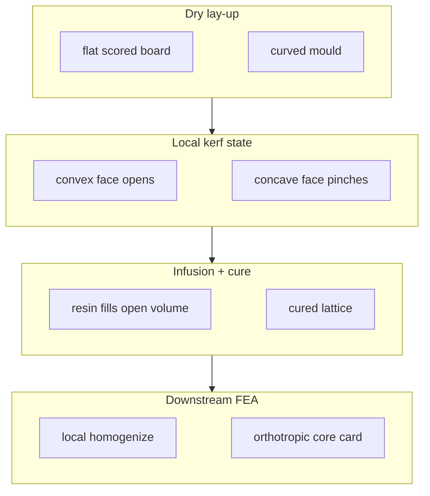
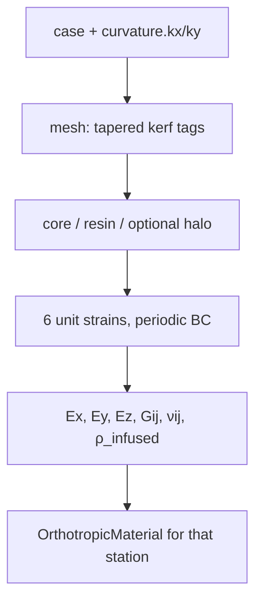

Grooved cores are dry-laid into a (generally curved) mould. Before infusion the
mould **opens or closes the kerfs**, so the resin volume and the cured effective
stiffness depend on **where the panel sits on the tool**. `b3_core` keeps the RVE
**flat** and encodes that effect by **tapering the groove geometry** with a local
mould curvature — the global bend itself is left to the downstream shell / beam
model.

## How kerf taper is computed

The figures explain the **computation**, not a uniform roll of the FEA mesh.

| Panel | Geometry | Role |
|-------|----------|------|
| **1 · On the mould** | Rigid **rectangular** foam lands hinged about their centres; kerfs = **gaps between facing land edges** | Physical picture: curvature opens/closes those gaps |
| **2 · Flattened for FEA** | Interval-affine morph: walls track `hw(z)` (trapezoidal foam) | How that opening is encoded for homogenization |

**Step 1 — hinge.** With pitch `p` and curvature `κ`, neighbouring land centres
differ by angle `κ·p`. Facing land edges open (or close) by that hinge.

**Step 2 — slope law.** The FEA taper that matches that opening (small-angle) is

```
slope  = −sign(depth) · κ · pitch / 2
hw(z)  = max(ε, hw₀ + slope · ζ)
```

with `ζ` distance from the root toward the mouth. Callouts on the figures show
`hinge ∠ ≈ κ·p` (mould) and `FEA walls ∠` from `hw(z)` (flat).

**Step 3 — morph.** `create_grooved_mesh` builds a flat RVE and morphs wall nodes
to `c0 ± hw(z)`. Homogenization never meshes the macro bend — only this local
`hw(z)`.

**Open** (`kx > 0` — kerfs flare at the free face):


**Closed** (`kx < 0` — kerfs pinch at the free face):


```bash
uv run python examples/curved_panel/render.py
# → img/groove_curved_vs_flat.png         (open)
# → img/groove_curved_vs_flat_closed.png  (closed)
# → img/groove_strip.png                  (flat RVE: closed | flat | open)
```

Open / flat / closed on the **flattened** RVE alone:


## Physical picture



| State | Geometry | Resin after infusion | Effective moduli |
|-------|----------|----------------------|------------------|
| **Open** (`κ` opens the mouth) | Kerf flares toward the free/mould face | Higher `resin_vf`, higher `ρ_infused` | Typically stiffer (more resin lattice) |
| **Flat** (`κ = 0`) | Prismatic rectangular groove | Nominal kerf volume | Baseline |
| **Closed** (`κ` pinches the mouth) | Walls taper; width clamped ≥ 0 | Lower `resin_vf` | Softer, approaches ungrooved foam when fully shut |

Closing is limited by **lock** (zero mouth width on the structured mesh). Contact
or interpenetration of pinched foam walls is not modelled.

## Geometry model

A curvature `kx` / `ky` **[1/mm]** acts on the corresponding groove family
(`kx` → `xgr`, `ky` → `ygr`). Each groove wall rotates about the **root corner**:

```
slope  = −sign(depth) · κ · pitch / 2
hw(z)  = max(ε, hw_nominal + slope · ζ)
```

where `ζ` is distance from the root toward the mouth. Opening increases the
mouth half-width by about `Δ ≈ κ · pitch · depth` (order of magnitude); closing
reduces it until a small ε clamp (solver-stable pinch).

**Mesh (flattened FEA RVE):** built as a rectangular structured grid, then
**interval-affine morph** so wall faces track `hw(z)`. Foam bays between open
kerfs become **trapezoidal** on this flat RVE (intended). The curved-panel
render rolls **that exact mesh** onto a cylinder (no second geometry builder).

| Sign of depth | Mouth | Root | Typical use |
|---------------|-------|------|-------------|
| **Negative** | Top / free face | Near bottom ligament | Mould-side scoring, open with `kx > 0` on that family |
| **Positive** | Bottom face | Toward top | Opposite-face channels |

A **single** `κ` opens grooves that mouth on one face and closes those that mouth
on the other — the sign of `depth` sets which way the taper goes.

```json
{
  "xgr": [[10, 10, -27, 3]],
  "curvature": { "kx": 0.004, "ky": 0.0 },
  "backend": "mfem"
}
```

Reference case: `examples/curved_panel/base.json` — 30 mm core, depth `−27`
(3 mm foam hinge), pitch 10 mm, nominal width 3 mm.

| Thickness | Depth for 3 mm floor |
|-----------|----------------------|
| 25 mm | −22 |
| 30 mm | −27 |
| 50 mm | −47 |

## How homogenization sees it

The **curved (rolled)** view is visualization only. The solver uses the
**flat interval-morphed RVE** (trapezoidal foam + tapered kerfs). Resin tags
stay the flat rectangular bands; volumes change with the morph. Six periodic
unit-strain solves return engineering constants for that local geometry.



1. Build RVE mesh with rectangular grooves if `κ = 0`, or z-dependent `hw(z)` if not.
2. Tag resin vs core (and optional [resin halo](/docs/concepts/resin-halo) outside the neat kerf).
3. Homogenize with `ccx` / `mfem` / `numpy` as usual.
4. Hand off one orthotropic card **per curvature station** (or per panel location).

The RVE remains flat by design. Macroscopic panel curvature is applied in the
global model; here only the **local kerf opening** that that curvature would have
produced is represented.

See [Periodic homogenization](/docs/concepts/method) for load cases and
[Homogenize for FEA](/docs/guides/homogenize) for material-card handoff.

## What changes with κ

When a resin halo is also active (`core.cell_size`), channel stiffness and resin
volume still rank with open/close — see the parametric **Eyy** and Vf boards on
[Halo + curvature](/docs/concepts/halo-curvature#stiffness-vs-curvature-and-halo-width).

From the curved-panel sweep (MFEM, deep uniaxial grooves, moduli in **GPa**):

| kx [1/mm] | R [mm] | state | resin_vf | ρ_inf | Exx | Eyy | Ezz | Gxy |
|----------:|-------:|:-----:|---------:|------:|----:|----:|----:|----:|
| −0.0080 | 125 | closed | 0.235 | 334 | 0.213 | 0.803 | 0.528 | 0.067 |
| −0.0040 | 250 | closed | 0.306 | 405 | 0.236 | 1.007 | 0.642 | 0.074 |
| 0 | flat | — | 0.342 | 442 | 0.251 | 1.112 | 0.711 | 0.078 |
| +0.0040 | 250 | open | 0.391 | 491 | 0.273 | 1.251 | 0.725 | 0.085 |
| +0.0080 | 125 | open | 0.439 | 539 | 0.302 | 1.391 | 0.751 | 0.094 |

Deep channels move a lot of resin: opening lifts `resin_vf` ~0.23 → 0.44 and
every modulus rises. Channels along **y** make **Eyy** respond most strongly
(~0.80 → 1.39 GPa). Closing pinches toward ungrooved foam.

Individual frames (same viewing direction as the strip):

<div className="my-6 grid grid-cols-1 gap-4 md:grid-cols-3">
  <figure>
    
    <figcaption className="mt-2 text-center text-sm text-fd-muted-foreground">Closed (kx &lt; 0)</figcaption>
  </figure>
  <figure>
    
    <figcaption className="mt-2 text-center text-sm text-fd-muted-foreground">Flat (kx = 0)</figcaption>
  </figure>
  <figure>
    
    <figcaption className="mt-2 text-center text-sm text-fd-muted-foreground">Open (kx &gt; 0)</figcaption>
  </figure>
</div>

## Grading along a panel

A shell model often needs properties that vary with arc length. Sample local `κ(s)`,
homogenize once per station, interpolate the engineering constants in the
global mesh:

```bash
uv run python examples/curved_panel/sweep.py        # κ → property table
uv run python examples/curved_panel/curve_field.py  # κ(s) along a panel → field
uv run python examples/curved_panel/render.py       # geometry strip PNGs
```

Example field for `kx(s) = κ_max · sin(π·s/L)` (flat ends, max open mid-span):

| s [mm] | kx [1/mm] | resin_vf | Eyy [GPa] | Ezz [GPa] |
|-------:|----------:|---------:|----------:|----------:|
| 0 | 0 | 0.342 | 1.112 | 0.711 |
| 83 | 0.0040 | 0.391 | 1.251 | 0.725 |
| 167 | 0.0069 | 0.426 | 1.353 | 0.743 |
| 250 | 0.0080 | 0.439 | 1.391 | 0.751 |
| … | symmetric | … | … | … |

`resin_vf` and `Eyy` peak mid-span where the mould opens the grooves widest.

Parametric CLI sweep (shared study root with thickness / patterns):

```bash
b3_core sweep curvature --root examples/param_sweeps
# or full chain:
b3_core sweep homogenise --root examples/param_sweeps
```

## Groove family fields (flat or curved)

Each row in `xgr` / `ygr`:

```
[offset, spacing, depth, width]   # all mm
```

| Field | Role |
|-------|------|
| `offset` | First groove centre in the transverse coordinate |
| `spacing` | Pitch between parallel grooves |
| `depth` | Signed cut depth (mouth face — see table above) |
| `width` | Nominal kerf width at the **root** (before taper) |

- **`xgr`** — grooves parallel to **x** (centres vary in **y**); tapered by `kx`.
- **`ygr`** — grooves parallel to **y** (centres vary in **x**); tapered by `ky`.

Empty list = plain core in that direction. Mixed families (two-sided, shallow +
deep) work with the same taper rule. Patterns: `examples/mfem_patterns/`.

## Limitations

- RVE is **flat** — only kerf width tapers; macroscopic bend is external.
- Over-closed grooves **clamp to zero width** (solid foam); no foam-to-foam contact.
- Flattened FEA open/close is an **interval-affine wall morph** (foam becomes
  trapezoidal). Stair-step voxel tagging is not used. Pinch is clamped to a
  minimum half-width so cells keep positive volume.
- [Resin halo](/docs/concepts/resin-halo) (`cell_size`) still applies outside the
  **tapered** neat kerf when set — open/close changes the surface the halo
  attaches to. Full composition contract:
  [Halo + curvature](/docs/concepts/halo-curvature).

Figures are **2D PyVista side views** of the FEA mesh (flat + rolled).
See `examples/curved_panel/render.py`.

## Related

- [Periodic homogenization](/docs/concepts/method) — six load cases → constants
- [Resin halo](/docs/concepts/resin-halo) — opened foam cells outside the neat kerf
- [Halo + curvature](/docs/concepts/halo-curvature) — shared `hw(z)` for halo + taper
- [Input schema](/docs/reference/input-schema) — `curvature`, `xgr` / `ygr`
- Worked tree: `examples/curved_panel/`
