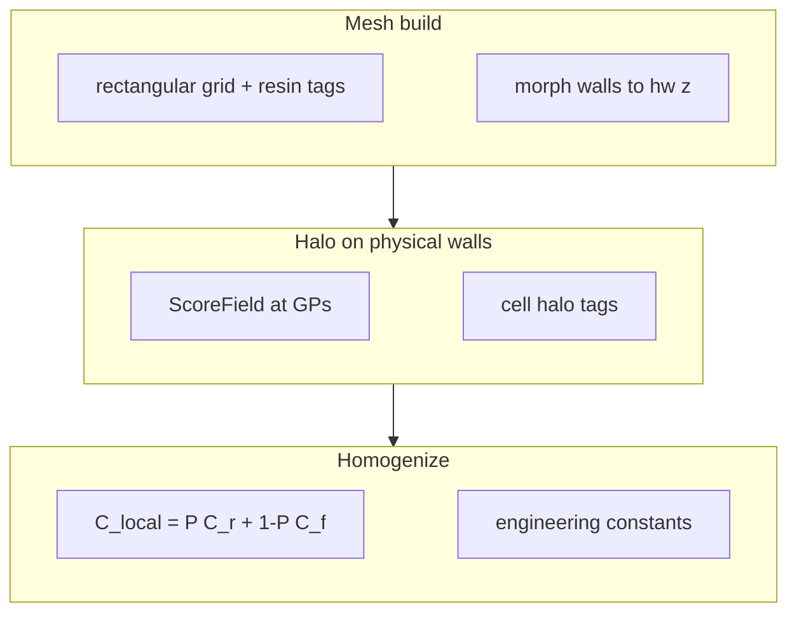

[Resin halo](/docs/concepts/resin-halo) grades foam stiffness with distance to the
**cut surface**. [Kerf open & close](/docs/concepts/curvature) moves that surface
with mould curvature via `hw(z)`. Together they **compose**: the halo attaches to
the *tapered* neat kerf, not the flat rectangular tag.

```
flat rectangular resin tags
        │
        ▼
  interval-affine morph  →  walls at c0 ± hw(z)
        │
        ├─ ScoreField  →  d = dist to tapered wall  →  P(resin) at GPs
        └─ geometric halo tags (viz / band) outside post-morph walls
```

Zone picture (flat kerf) from the halo concept page — same three layers when
the wall is tapered:


## Halo on the kerf open & close RVE

Same geometry and κ as [Kerf open & close](/docs/concepts/curvature)
(`examples/curved_panel/base.json`, top-mouth depth `−27`,
`kx = ±0.012`), with a resin halo painted on the **morphed** FEA walls.

- **Dark red** — neat resin after `hw(z)` morph
- **Discrete RWB bands** — `P(resin)` only in the halo rim (grey = intact foam)
- **Solid black** — kerf wall `hw(z)`; **blue dotted** — outer reach (`wall + cell_size`)

Figure uses `cell_size = 1.5` mm so the rim is readable at RVE scale (production
cases are often ~0.6 mm; the law is the same). Closed pinches the free face;
open flares it — the halo rim moves with those walls.


Wall-normal strips at mouth and root collapse onto one survival curve: the
**wall moves** with κ, the **decay law `S(d)` does not**.


```bash
uv run b3_core viz halo-curvature -o examples/img
# → halo_curvature_compose.png      (closed | flat | open + zoom)
# → halo_curvature_wall_strip.png
# → halo_curvature_stiffness.png    (Eyy, resin Vf vs κ × cell_size)
# → halo_curvature_moduli_vs_kx.png
```

## Stiffness vs curvature and halo width

How much does **mould curvature** and **halo width** move the engineering
constants? A compact top-mouth uniaxial RVE (same open/close sign as
`examples/curved_panel`) is homogenized on a grid of

| Axis | Values |
|------|--------|
| `kx` [1/mm] | −0.010 … +0.010 (9 points) |
| `cell_size` [mm] | 0 (sharp), 0.3, 0.6, 1.0, 1.5 |

Each point is a full six-load numpy homogenization with shared `hw(z)`.

### Four-panel response board

| Panel | What it shows |
|-------|----------------|
| **Top-left** | **Eyy vs kx** — one curve per halo width (colour) |
| **Top-right** | **Eyy vs cell_size** — closed / flat / open slices |
| **Bottom-left** | **neat resin_vf** (solid) and **effective_resin_vf** (dashed) vs kx |
| **Bottom-right** | **Eyy heatmap** over the full `kx × cell_size` plane |


### Trends

1. **Open stiffens** — for top-mouth grooves, `kx > 0` flares the free face →
   higher neat resin volume → higher **Eyy**.
2. **Halo stiffens** — at every fixed κ, larger `cell_size` raises **Eyy**
   (wider resin-rich band outside the wall).
3. **Volumes rank** —
   `resin_vf(open) > resin_vf(flat) > resin_vf(closed)` and
   `effective_resin_vf = resin_vf + halo_vf` always sits above neat `resin_vf`
   when the halo is on.
4. **Composition is separable** on this layout: opening moves you right on the
   heatmap; widening the halo moves you up — both increase channel stiffness.

### All moduli vs curvature (halo vs sharp)

Solid lines: `cell_size = 0.6` mm. Dashed: sharp kerf (`cell_size = 0`).


Primary modulus for this uniaxial layout is **Eyy** (along the resin channels).
It tracks open/close and halo width cleanly on the fast numpy path used for the
sweep. Through-thickness **Ezz** on highly tapered thin RVEs needs a refined FEA
backend for quantitative work; composition ranking for resin volume and channel
stiffness remains robust.

Regenerate (cached grid → `halo_curvature_param_grid.json`):

```bash
uv run b3_core viz halo-curvature -o examples/img
# → halo_curvature_stiffness.png
# → halo_curvature_moduli_vs_kx.png
# → halo_curvature_param_grid.json
```

API: `b3_core.viz.halo.sweep_halo_curvature_grid`,
`plot_stiffness_vs_curvature_halo`, `homogenize_halo_curvature`.
Tests: `tests/test_halo_viz.py::test_parametric_stiffness_ranks_open_and_halo`.

## Physics surrogate — mass lookup vs curvature

For panel stations (or any batch of local curvatures) a full homogenization per
point is unnecessary once a small grid has been run. Following the same pattern
as `b3_invsec.physics_surrogate`:

```
T(κ, cell_size)  =  physics_base(κ, cell_size) · exp( φ · c )
```

- **physics_base** — closed-form neat/halo volumes from the `hw(z)` taper law,
  Voigt/Reuss mixture for channel vs cross-channel moduli, two-phase density →
  areal mass
- **φ · c** — low-order log correction fit to the homogenization grid (ridge
  least squares)

### Fit once

```bash
uv run b3_core surrogate fit -o examples/img/core_physics_surrogate.json \
  --cache examples/img/halo_curvature_param_grid.json
```

```python
from b3_core import fit_from_homogenization

surr = fit_from_homogenization(cache_path="examples/img/halo_curvature_param_grid.json")
surr.to_json("core_physics_surrogate.json")
```

### Batch lookup (vector of curvatures)

```python
import numpy as np
from b3_core import CorePhysicsSurrogate

surr = CorePhysicsSurrogate.from_json("core_physics_surrogate.json")
kx = np.linspace(-0.008, 0.008, 50)          # e.g. κ(s) along a panel
props = surr.lookup(kx, cell_size=0.6)       # DataFrame: E*, G*, rho, mass_per_m2, Vf
```

```bash
# use --kx=… so a leading minus is not parsed as a flag
uv run b3_core surrogate lookup core_physics_surrogate.json \
  --kx=-0.008,0,0.004,0.008 --cell-size 0.6 -o stations.csv
```

| Column | Unit | Role |
|--------|------|------|
| `Exx`…`Gyz` | Pa | Engineering moduli |
| `resin_vf`, `halo_vf`, `effective_resin_vf` | — | Volume fractions |
| `rho_infused` | kg/m³ | Infused density |
| `mass_per_m2` | kg/m² | Areal mass (`ρ · thickness`) |

API: `b3_core.physics_surrogate` — `fit_physics_surrogate`,
`fit_from_homogenization`, `CorePhysicsSurrogate.lookup`.
Tests: `tests/test_physics_surrogate.py`.

## Shared law

Both mechanisms use the same root-hinged half-width:

```
slope  = −sign(depth) · κ · pitch / 2
hw(z)  = max(ε, hw₀ + slope · ζ)
```

with `ζ` measured from the groove root toward the mouth. That is exactly the
wall law of the FEA morph and of `ScoreField.distance_to_saw_cut`.

| Layer | What it does with `hw(z)` |
|-------|---------------------------|
| **Morph** | Moves wall nodes so faces sit at `c0 ± hw(z)` (trapezoidal foam bays) |
| **ScoreField** | Distance to saw-cut uses the same `hw(z)` at each evaluation `z` |
| **Geometric `halo` tag** | Marks cells with gap ∈ `[0, s_halo]` **outside** post-morph walls |

If the halo used the *pre-morph* rectangular wall, open mouths would under-count
the resin-rich band and closed mouths would over-count it. Composition means
**one surface, two consumers**.

## Pipeline order



1. Build a **flat** structured RVE; neat resin tags are rectangular (topology fixed).
2. If `kx` / `ky` ≠ 0, **morph** wall faces so half-width tracks `hw(z)`.
3. Compute **geometric halo** cell tags on **post-morph** centres (optional viz / band).
4. At integration points, **ScoreField** evaluates `P(resin)` from distance to the
   **tapered** wall (and optional face halo).
5. `numpy` integrates rule-of-mixtures stiffness; outputs include `resin_vf`,
   `halo_vf`, `effective_resin_vf`.

Backend: `core.cell_size` (halo) **auto-routes to `numpy`**. Curvature alone can
stay on `mfem` / `ccx`; with both, you still get open/close ranking on the
morphed mesh under the halo integrator.

## What open / close does to the halo

| State | Neat kerf | Halo band | Typical effect |
|-------|-----------|-----------|----------------|
| **Open** | Mouth flares (`hw` ↑ toward free face) | Band rides outside the flared wall | Higher `resin_vf`, higher `effective_resin_vf`, stiffer |
| **Flat** | Prismatic `hw = hw₀` | Nominal stand-off from rectangular wall | Baseline |
| **Closed** | Mouth pinches (`hw` ↓, clamp ≥ ε) | Band rides outside the pinched wall | Lower neat + graded resin; softer |

Open/close still **ranks** when halo is on (see [parametric board](#stiffness-vs-curvature-and-halo-width)):

```
resin_vf(open)  > resin_vf(flat)  > resin_vf(closed)
eff_vf(open)    > eff_vf(flat)    > eff_vf(closed)
Eyy(open)       > Eyy(closed)     (with or without halo)
```

and for each morph state, halo still **boosts** channel stiffness vs the
sharp-kerf twin (`Eyy(halo) > Eyy(sharp)`). Locked in by
`tests/test_halo_curvature.py` and `tests/test_halo_viz.py`.

## Geometry sketch

Through-thickness cut (schematic — not to scale):

```
OPEN mouth (κ opens free face)          CLOSED mouth (κ pinches)

  free face ════════════════            free face ════════════════
       │  neat  │                        │neat│
       │ resin  │ ← flared               │    │ ← pinched
       │████████│  P→1 at wall           │████│  P→1 at wall
       │ ░░░░░░ │  halo band s_halo      │ ░░ │  same s_halo outside
       │  foam  │  P→0 at reach          │foam│
       └────────┘ root                   └────┘ root
```

`P(resin)` still decays with **wall-normal** distance; only the wall *location*
moved with `κ`. Face-surface halo (unsawn top/bottom) is independent of kerf
taper and is combined by `max(S_saw, S_face)` as usual.

## Mesh refinement when both are on

`create_grooved_mesh(..., s_halo=..., kx=..., ky=...)` densifies lines so the
band is resolved:

- Halo offsets at nominal `hw₀ + s_halo`
- When `κ ≠ 0`, extra lines at **max |hw(z)| + s_halo** (open mouth or closed
  root flare) so the foam strip next to the extreme wall is not under-resolved
- Extra `z` stations through the groove depth so morphed walls are
  piecewise-linear

`s_halo` itself is `damage_cells × max active surface reach` (see
[Resin halo](/docs/concepts/resin-halo#scoring-block)).

## Minimal case (textile-as-code)

Top-mouth curved panel + resin halo; **`kx > 0` opens**, `kx < 0` closes:

```python
from b3_core import curved_panel, homogenize

case = (
    curved_panel(thickness=30, ligament=3, kx=0.012)
    .with_halo(0.6, face_enabled=False)  # saw-cut rim only
)
result = homogenize(case)
# optional interchange: case.to_json("curved_halo.json")
```

Drop `.with_halo(...)` for sharp kerf only; drop `kx` / use
`curved_panel(kx=0)` for halo on a prismatic groove. Grid-scored flat sheet:

```python
from b3_core import grid_scored

grid_scored(cell_size=0.6)  # both directions, DIAB-style
```

Composition tests: `tests/test_halo_curvature.py`. Parametric stiffness:
`tests/test_halo_viz.py::test_parametric_stiffness_ranks_open_and_halo`.

## What each output means under composition


| Output | With both |
|--------|-----------|
| `resin_vf` | Neat kerf volume after morph (open/close ranks) |
| `halo_vf` | Extra expected resin from `P` in the foam band outside the **tapered** wall |
| `effective_resin_vf` | `resin_vf + halo_vf` — still ranks open > flat > closed |
| `rho_infused` | Density using effective resin |
| Engineering moduli | Embed graded `C_local` on the morphed geometry |

For FEA handoff the orthotropic card already includes both effects — no separate
halo shell or curvature kerf solid is required in the global model.

## Limitations

- Composition is **local**: one `κ` and one `cell_size` per RVE station. Panel-scale
  grading still means one homogenization per station (see curvature field sweep).
- Geometric cell `halo` tags are a **band visualization / mesh aid**; stiffness
  comes from ScoreField at Gauss points, not from those tags alone.
- Over-closed kerfs clamp at ε half-width; the halo still attaches to that clamp.
- Face halo does not track kerf walls (by design — unsawn skins).

## Related

- [Resin halo](/docs/concepts/resin-halo) — `cell_size`, survival `S(d)`, scoring
- [Kerf open & close](/docs/concepts/curvature) — mould hinge → `hw(z)` morph
- [Periodic homogenization](/docs/concepts/method) — RVE tags and six load cases
- [Visualization & reports](/docs/guides/visualization) — figure CLI and gallery
- [Input schema](/docs/reference/input-schema) — `curvature`, `core.cell_size`, `scoring`
- [Backends](/docs/reference/backends) — halo → `numpy` auto-route
- [CLI](/docs/reference/cli) — `surrogate fit` / `surrogate lookup`
