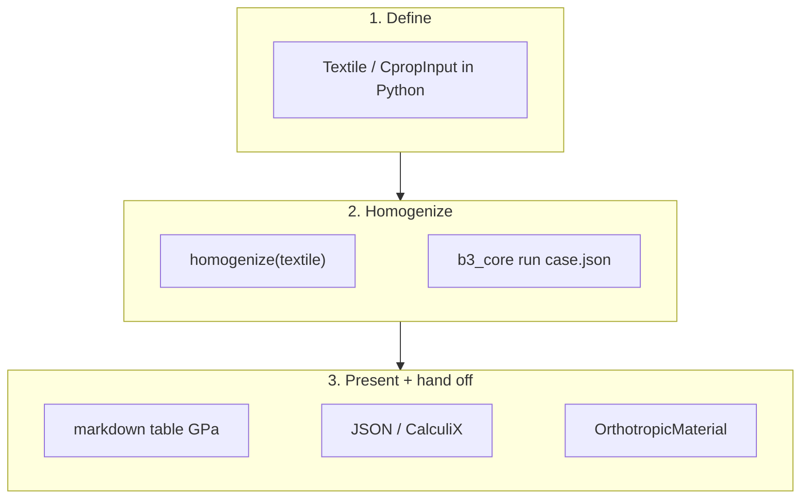

`b3_core` is built so an agent can own the full loop: write a case, run the RVE,
present constants, and hand off a material card — without asking the human to
type CLI. The **source of truth** for that behaviour is the packaged skill
document.

## Load the skill

Repo-root [`SKILL.md`](https://github.com/wr1/b3_core/blob/master/SKILL.md) is
copied into the package as `b3_core/SKILL.md`. Agents should load it at the start
of a homogenization session:

```bash
b3_core skill              # path on disk
b3_core skill --stdout     # full markdown (paste into context)
```

```python
from b3_core.skill import read_skill, skill_path

print(skill_path())   # checkout or site-packages path
text = read_skill()   # full SKILL.md
```

**Triggers** (when to load): “homogenize core”, grooved / infused core stiffness,
resin halo, curvature-dependent core, core surrogate, `cprop`, material card for
FEA.

## Agent workflow



1. **Construct a textile in Python** — prefer `b3_core.cases` factories
   (`plain`, `uniaxial`, `grid_scored`, …) or `CpropInput`. Geometry mm, materials SI.
   Dump JSON only if the CLI or a frozen fixture is required.
2. **Run yourself** — `homogenize(textile)` (or CLI on a path). Do not ask the user
   to run commands.
3. **Extract** — engineering constants from `CoreResult` / `run*.json`.
4. **Present** — markdown table with moduli in **GPa** (divide Pa by `1e9`).
5. **Hand off** — `result.material` (`b3_mat.OrthotropicMaterial`), JSON card, or
   CalculiX engineering-constants block.
6. **Optional** — datasheet, gallery, sweep, or physics surrogate for κ-fields.

## Commands agents use most

| Goal | Command / API |
|------|----------------|
| Homogenize one case | `b3_core run case.yaml` or `homogenize("case.json")` |
| Full pipeline dict | `cprop("case.json")` (also writes `run*.json`) |
| Parametric study | `b3_core sweep homogenise --root <dir>` |
| Publication board | `b3_core viz view case.json --what gallery -o board.png` |
| One-page report | `b3_core viz datasheet case.json -o card.pdf --png card.png` |
| Skill text | `b3_core skill --stdout` |

From a dev checkout, prefix with `uv run`. Default backend is **mfem**. Cases with
orthotropic foam or `core.cell_size` (resin halo) auto-route to **numpy**.

## Minimal agent script

```python
from b3_core import grid_scored, homogenize, plain

r = homogenize(plain())  # or grid_scored(cell_size=0.6).with_curvature(kx=0.0)
# r = homogenize("examples/simple.json")  # file still works (interchange)
m = r.material

# Always show a table (moduli as GPa for humans / FEA decks)
for label, value in [
    ("Ex", f"{m.Ex/1e9:.4f} GPa"),
    ("Ey", f"{m.Ey/1e9:.4f} GPa"),
    ("Ez", f"{m.Ez/1e9:.4f} GPa"),
    ("Gxy", f"{m.Gxy/1e9:.4f} GPa"),
    ("Gxz", f"{m.Gxz/1e9:.4f} GPa"),
    ("Gyz", f"{m.Gyz/1e9:.4f} GPa"),
    ("νxy", f"{m.nuxy:.4f}"),
    ("νxz", f"{m.nuxz:.4f}"),
    ("νyz", f"{m.nuyz:.4f}"),
    ("ρ infused", f"{m.rho:.1f} kg/m³"),
    ("resin Vf", f"{r.resin_volume_fraction:.3f}"),
]:
    print(f"| {label} | {value} |")
```

JSON card for matdb / scripts:

```python
card = {
    "name": "grooved_core_homogenized",
    "Ex": m.Ex, "Ey": m.Ey, "Ez": m.Ez,
    "Gxy": m.Gxy, "Gxz": m.Gxz, "Gyz": m.Gyz,
    "nuxy": m.nuxy, "nuxz": m.nuxz, "nuyz": m.nuyz,
    "rho": m.rho,
}
```

## When the case needs more than plain kerfs

| Need | Case knobs | Where to read |
|------|------------|---------------|
| Resin-rich band from opened cells | `core.cell_size`, optional `scoring` | [Resin halo](/docs/concepts/resin-halo) |
| Kerf open/close on a mould | `curvature.kx` / `ky` (1/mm), groove depths | [Kerf open & close](/docs/concepts/curvature) |
| Both together / κ mass lookup | scored + curved case; physics surrogate | [Halo + curvature](/docs/concepts/halo-curvature) |
| FEA material card detail | constants, CalculiX, 6×6 C | [Homogenize for FEA](/docs/guides/homogenize) |
| Figures for review | `viz` gallery / datasheet / halo | [Visualization](/docs/guides/visualization) |

Shipped fixtures agents can copy:

| Path | Role |
|------|------|
| `examples/simple.json` | Ungrooved baseline |
| `examples/with_grooves.json` | Mixed groove families |
| `examples/mfem_patterns/*.json` | Pattern gallery |
| `examples/diab_gs30_scored.json` | Grid-scored + halo |
| `examples/curved_panel/` | Curvature / open-close demos |

## Operating rules

- **Run commands yourself.** The skill is written for agent execution, not for
  handing shell snippets back to the user.
- **Units:** geometry **mm**; moduli and density **SI** (Pa, kg/m³). Present
  moduli as **GPa** in tables.
- **Axes:** x = machine, y = transverse, z = through-thickness.
- **Cache:** if `FileExistsError` on `run*.json`, delete the stale run file or use
  a fresh directory.
- **Handoff target:** replace the **core layer** in the global model with smeared
  orthotropic properties — do not mesh grooves in the blade FEA.
- **Skill vs docs:** `SKILL.md` is the compact agent playbook; this site holds
  longer explanations. Prefer the skill for step-by-step execution; open concept
  pages when the physics of a knob is unclear.

## Related

- [Getting started](/docs/guides/getting-started) — install and first human run
- [Homogenize for FEA](/docs/guides/homogenize) — cards and tables
- [CLI reference](/docs/reference/cli) — `run`, `sweep`, `viz`, `skill`
- [Input schema](/docs/reference/input-schema) — full `CpropInput` fields
