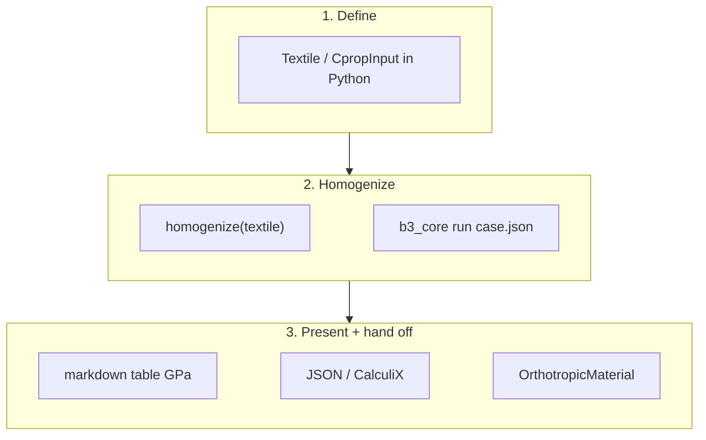

`b3_core` is built so an agent can own the full loop: write a case, run the RVE,
present constants, and hand off a material card — without asking the human to
type CLI. The **source of truth** for that behaviour is the packaged skill
document.

## Load the skill

Repo-root [`SKILL.md`](https://github.com/wr1/b3_core/blob/master/SKILL.md) is
copied into the package as `b3_core/SKILL.md`. Agents should load it at the start
of a homogenization session:

```bash
b3_core skill              # path on disk
b3_core skill --stdout     # full markdown (paste into context)
```

```python
from b3_core.skill import read_skill, skill_path

print(skill_path())   # checkout or site-packages path
text = read_skill()   # full SKILL.md
```

**Triggers** (when to load): “homogenize core”, grooved / infused core stiffness,
resin halo, curvature-dependent core, core surrogate, `cprop`, material card for
FEA.

## Agent workflow


```mermaid
flowchart TB
  subgraph prep[1. Define]
    direction LR
    code["Textile / CpropInput in Python"]
  end
  subgraph run[2. Homogenize]
    direction LR
    py["homogenize(textile)"] ~~~ cli["b3_core run case.json"]
  end
  subgraph handoff[3. Present + hand off]
    direction LR
    table[markdown table GPa] ~~~ card[JSON / CalculiX] ~~~ mat[OrthotropicMaterial]
  end
  prep --> run --> handoff
```

1. **Construct a textile in Python** — prefer `b3_core.cases` factories
   (`plain`, `uniaxial`, `grid_scored`, …) or `CpropInput`. Geometry mm, materials SI.
   Dump JSON only if the CLI or a frozen fixture is required.
2. **Run yourself** — `homogenize(textile)` (or CLI on a path). Do not ask the user
   to run commands.
3. **Extract** — `b3_core run case.json --json --units GPa`. Each property is
   `{value, unit}`. Do not divide pascals by `1e9`.
4. **Present** — the payload's `properties` and `stiffness` (`stiffness_unit`
   is `GPa`). Poisson ratios keep unit `-`.
5. **Hand off** — `result.material` (`b3_mat.OrthotropicMaterial`), JSON card, or
   CalculiX engineering-constants block.
6. **Optional** — datasheet, gallery, sweep, or physics surrogate for κ-fields.

## Commands agents use most

| Goal | Command / API |
|------|----------------|
| Homogenize one case | `b3_core run case.yaml` or `homogenize("case.json")` |
| Full pipeline dict | `cprop("case.json")` (also writes `run*.json`) |
| Parametric study | `b3_core sweep homogenise --root <dir>` |
| Publication board | `b3_core viz view case.json --what gallery -o board.png` |
| One-page report | `b3_core viz datasheet case.json -o card.pdf --png card.png` |
| Curvature sheet | `b3_core viz datasheet case.json --full --draft --prose prose.json` |
| Calibrate | `b3_core fit bounds` then `fit run` (see the skill) |
| Accept a project | `b3_core check accept project.yaml --json` |
| Skill text | `b3_core skill --stdout` |

From a dev checkout, prefix with `uv run`. Default backend is **auto**: FEniCSx
when that environment is installed, otherwise MFEM, including orthotropic foam
and a resin halo (`core.cell_size`) on a flat case. A curved case uses FEniCSx
only. Numpy is an explicit opt-in on a curve and warns about the offset in the
backends table.

## Minimal agent script

```bash
# Bottom mouth: negative kx opens the kerf. geometry.kerfs lists root and mouth.
b3_core run case.json --json --units GPa --no-write
```

```python
import json, subprocess

payload = json.loads(subprocess.check_output(
    ["b3_core", "run", "case.json", "--json", "--units", "GPa", "--no-write"],
    text=True,
))
# properties["Ex"]["value"] is already GPa. properties["nuxy"]["unit"] is "-".
# stiffness matches stiffness_unit. geometry.rho_infused is {value, unit}.
```

`homogenize(grid_scored(cell_size=0.6), kx=-0.008)` still returns SI pascals
on `CoreResult` for a Python caller that needs the material object.

JSON card for matdb / scripts (SI pascals, from the Python result):

```python
from b3_core import homogenize

m = homogenize("case.json").material
card = {
    "name": "grooved_core_homogenized",
    "Ex": m.Ex, "Ey": m.Ey, "Ez": m.Ez,
    "Gxy": m.Gxy, "Gxz": m.Gxz, "Gyz": m.Gyz,
    "nuxy": m.nuxy, "nuxz": m.nuxz, "nuyz": m.nuyz,
    "rho": m.rho,
}
```

## When the case needs more than plain kerfs

| Need | Case knobs | Where to read |
|------|------------|---------------|
| Resin-rich band from opened cells | `grid_scored(cell_size=…)` or `.with_halo(…)` | [Resin halo](/docs/concepts/resin-halo) (graphics) |
| Kerf open/close on a mould | `curved_panel(kx=…)` / `.with_curvature` | [Kerf open & close](/docs/concepts/curvature) |
| Both together / κ mass lookup | `curved_panel(...).with_halo(...)`; physics surrogate | [Halo + curvature](/docs/concepts/halo-curvature) |
| FEA material card detail | constants, CalculiX, 6×6 C | [Homogenize for FEA](/docs/guides/homogenize) |
| Figures for review | `viz` gallery / datasheet / halo | [Visualization](/docs/guides/visualization) |

Shipped fixtures agents can copy:

| Path | Role |
|------|------|
| `examples/simple.json` | Ungrooved baseline |
| `examples/with_grooves.json` | Mixed groove families |
| `examples/mfem_patterns/*.json` | Pattern gallery |
| `examples/grid_scored_halo.json` | Grid-scored + halo |
| `examples/curved_panel/` | Curvature / open-close demos |

## Calibrate to a sparse datasheet

Follow the decision table in the skill. The short form:

1. `fit.split_basis` splits neat rows (fixed) from infused rows (targets).
   Map each tested axis onto `Ex` / `Ey` / `Ez` / `Gxy` / `Gxz` / `Gyz`
   with `Target.axis_map`. One measured in-plane direction does not fill
   the other.
2. `b3_core fit bounds CASE --json` starts every parameter fixed.
3. Density or resin uptake goes through `fit estimate-halo` before any solve.
4. Free only the parameters the table names. `n_free` stays at or below the
   number of targets in use. Collinear pairs (`|corr| > 0.95`) keep the
   earlier name in `halo_cell_size`, `foam_Ez_scale`, `foam_G_scale`,
   `foam_E_scale`, `kerf_width`, `resin_E`.
5. `n_free < 3` calls `fit refine`. Three or more free parameters call
   `fit run` (design, quadratic surface, then refine).
6. A result is usable when `status` is `converged` and every `|z| ≤ 2`,
   or when nothing was free (`no_free_params`, labelled predicted).
   Anything else stops. Do not loosen bounds.
7. `sweep grid --fit-result calibrated_case.json` carries that case.

`Material.source` (`neat`, `infused`, `estimated`, `calibrated`) and
`Material.reference` stay off the cache key.

## Report a datasheet

Write `prose.json` and nothing else in the sheet. Do not edit the Typst
templates or type a modulus into a table. Run `b3_core check accept` first.
A check with `ok: false`, or a missing artifact, stops the task.

`prose.json` fields: `title`, `summary` (400 characters), `intended_use`
and `limitations` (160 each), optional `notes`.

```bash
b3_core sweep grid case.json --backend fenicsx --out grid/ --json
b3_core viz figs grid/manifest.json --out grid/
b3_core check accept project.yaml --json
b3_core viz datasheet case.json --full --draft --prose prose.json --sweep grid/manifest.json
```

Drop `--draft` only when accept returns `ok`. A curved sheet that is not
accepted prints "cross-checked on flat; curved values FEniCSx". Labels use
the signed radius `1/(1000·k)` metres. Each kerf row has its own
`opens_for`. Confirm the PDF with `pdftotext -layout`. The figures still
need a human look.

`b3_core report build project.yaml --out report/` writes the markdown and
Typst skeleton from the project JSON. It is not the prose.

## Operating rules

- **Run commands yourself.** The skill is written for agent execution, not for
  handing shell snippets back to the user.
- **Units:** geometry **mm**; Python moduli and density **SI** (Pa, kg/m³).
  A table comes from `b3_core run --json --units GPa`. Do not scale by `1e9`.
- **Axes:** x = machine, y = transverse, z = through-thickness.
- **Cache:** if `FileExistsError` on `run*.json`, delete the stale run file or use
  a fresh directory.
- **Handoff target:** replace the **core layer** in the global model with smeared
  orthotropic properties — do not mesh grooves in the blade FEA.
- **Skill vs docs:** `SKILL.md` is the compact agent playbook; this site holds
  longer explanations. Prefer the skill for step-by-step execution; open concept
  pages when the physics of a knob is unclear.

## Related

- [Getting started](/docs/guides/getting-started) — install and first human run
- [Homogenize for FEA](/docs/guides/homogenize) — cards and tables
- [CLI reference](/docs/reference/cli) — `run`, `sweep`, `viz`, `skill`
- [Input schema](/docs/reference/input-schema) — full `CpropInput` fields
