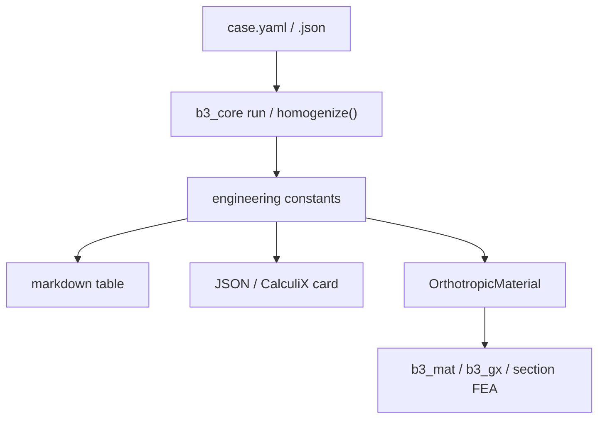

The primary product of `b3_core` is a smeared orthotropic core for a larger panel or
blade model. Groove geometry stays in the RVE; the global model sees constants only.

## Workflow



1. Write a `CpropInput` case (geometry + constituents).
2. Run homogenization → `run*.json` / `CoreResult`.
3. Hand off moduli + ρ to the structural model.
4. Optionally attach a datasheet or gallery figure for review.

## Engineering constants (primary handoff)

From `result.engineering_constants` or the run JSON:

| Key | Meaning | FEA alias |
|-----|---------|-----------|
| `Exx` | E along x [Pa] | `Ex` |
| `Eyy` | E along y [Pa] | `Ey` |
| `Ezz` | E through-thickness [Pa] | `Ez` |
| `Gxy`, `Gxz`, `Gyz` | Shear moduli [Pa] | same |
| `nuxy`, `nuxz`, `nuyz` | Poisson ratios | same |
| `rho_infused` | Effective density [kg/m³] | `rho` |
| `resin_vf` | Resin volume fraction | metadata |
| `area_increase` | Groove surface-area factor | metadata |

`CoreResult.material` maps `Exx→Ex`, `Eyy→Ey`, `Ezz→Ez` and `rho_infused→rho`.

## Markdown table (agent default)

Present moduli in **GPa** (divide Pa by 1e9):

```python
from b3_core import homogenize

r = homogenize("case.json")
m = r.material

rows = [
    ("Ex", f"{m.Ex/1e9:.4f} GPa"),
    ("Ey", f"{m.Ey/1e9:.4f} GPa"),
    ("Ez", f"{m.Ez/1e9:.4f} GPa"),
    ("Gxy", f"{m.Gxy/1e9:.4f} GPa"),
    ("Gxz", f"{m.Gxz/1e9:.4f} GPa"),
    ("Gyz", f"{m.Gyz/1e9:.4f} GPa"),
    ("νxy", f"{m.nuxy:.4f}"),
    ("νxz", f"{m.nuxz:.4f}"),
    ("νyz", f"{m.nuyz:.4f}"),
    ("ρ infused", f"{m.rho:.1f} kg/m³"),
    ("resin Vf", f"{r.resin_volume_fraction:.3f}"),
]
```

## JSON material card

```python
card = {
    "name": "grooved_core_homogenized",
    "Ex": m.Ex, "Ey": m.Ey, "Ez": m.Ez,
    "Gxy": m.Gxy, "Gxz": m.Gxz, "Gyz": m.Gyz,
    "nuxy": m.nuxy, "nuxz": m.nuxz, "nuyz": m.nuyz,
    "rho": m.rho,
}
```

Load into `b3_mat.MaterialDB` or pass to laminate / section builders.

## CalculiX engineering-constants card

```text
*material,name=core_hom
*elastic,type=engineering constants
Ex,Ey,Ez,nuxy,nuxz,nuyz,Gxy,Gxz,
Gyz,293
```

Substitute SI values from `result.material`. The temperature line (293 K) is a
placeholder for the target deck.

## Full 6×6 stiffness

When the solver needs the anisotropic tensor rather than engineering constants:

```python
from b3_core.viz import CoreModel

model = CoreModel.from_json("case.json")
C = model.stiffness       # Pa, Voigt order xx,yy,zz,yz,xz,xy
C_GPa = C * 1e-9
```

## Downstream targets

| Target | What to pass |
|--------|--------------|
| `b3_mat` / `b3_gx` | `homogenize(...).material` |
| CalculiX solid core | Engineering-constants card or matdb JSON |
| Full anisotropic solid | `CoreModel.stiffness` |
| Mass properties | `rho_infused` / `material.rho` |

## Parametric studies

```bash
b3_core sweep homogenise                  # thickness → curvature → patterns
b3_core sweep homogenise --root examples/param_sweeps
# or: make sweep
```

Response curves and GIFs live under `examples/offline/` (offline demos, not mainline).

## Halo cases

If `core.cell_size` is set (or constituents are orthotropic), the run auto-routes to the
**numpy** backend. Results then also include `halo_vf` and `effective_resin_vf`. See
[Resin halo](/docs/concepts/resin-halo). With curvature too:
[Halo + curvature](/docs/concepts/halo-curvature)
([Eyy / Vf vs κ × cell_size](/docs/concepts/halo-curvature#stiffness-vs-curvature-and-halo-width)).
