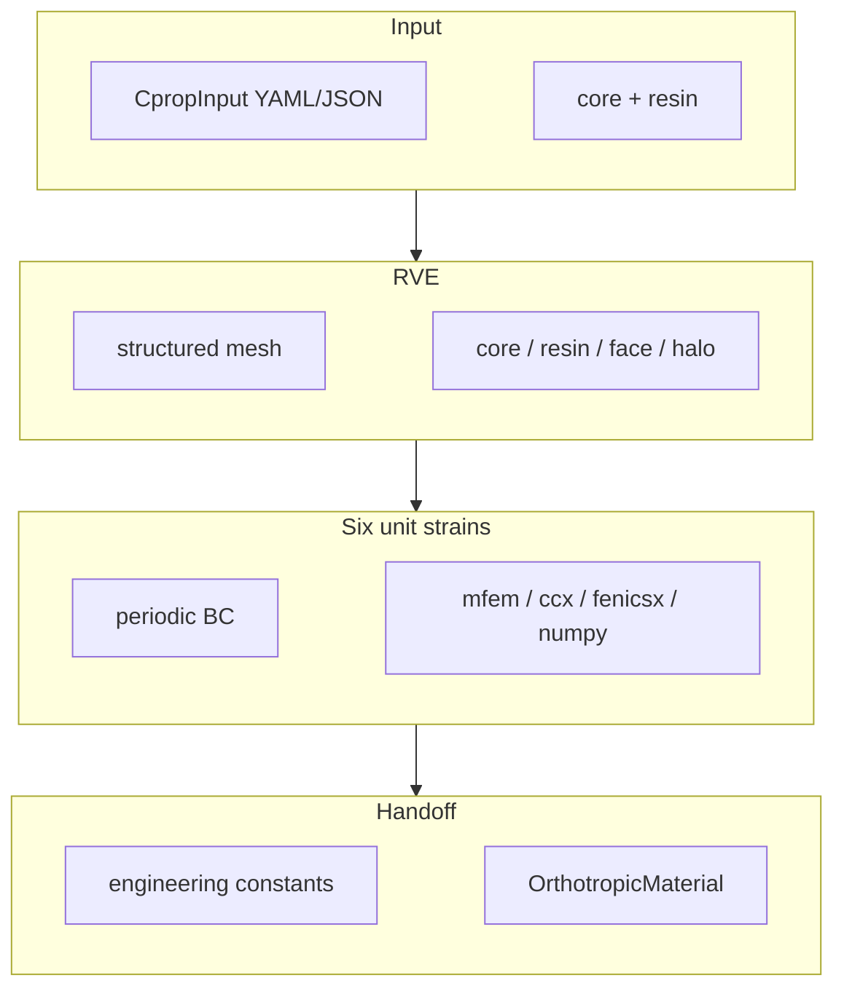

**Periodic-BC homogenization of grooved sandwich cores** — PVC foam or balsa with
sawcuts and machined grooves that fill with resin during vacuum infusion. The package
predicts the effective orthotropic material and returns it as a
`b3_mat.OrthotropicMaterial` for the wider b3 section / beam pipeline.


## What it computes

From a case file (geometry + core/resin materials) the RVE pipeline yields:

| Output | Unit | Role |
|--------|------|------|
| Ex, Ey, Ez | Pa | Young's moduli (x machine, y transverse, z thickness) |
| Gxy, Gxz, Gyz | Pa | Shear moduli |
| νxy, νxz, νyz | — | Poisson ratios |
| ρ infused | kg/m³ | Density including resin in grooves (and optional halo) |
| 6×6 C_eff | Pa | Full effective stiffness (Voigt) |
| resin Vf, area factor | — | Geometry metrics for infusion estimates |

## Method in one diagram



1. Build a structured 3D RVE over `[0, dx] × [0, dy] × [0, thickness]` (mm).
2. Tag cells as core, resin (groove volume), optional face layer, optional resin halo.
3. If `kx`/`ky` set, **morph walls** so kerfs track `hw(z)` (open/close).
4. Solve six unit macroscopic strains under periodic BC (**mfem** by default).
5. Average reactions and face jumps → orthotropic constants and infused density.

**Units:** geometry in mm; materials and outputs in SI (Pa, kg/m³). The mesh is scaled
by 1e-3 for solvers that need SI lengths.

## Where to read what

**Guides** — run something today.

- [Getting started](/docs/guides/getting-started) — install, first case, first run.
- [Agent use](/docs/guides/agent-use) — load the skill, agent workflow, handoff rules.
- [Homogenize for FEA](/docs/guides/homogenize) — material cards and tables for structural models.
- [Visualization & reports](/docs/guides/visualization) — gallery, datasheet, deformation modes, halo figures.

**Concepts** — the physics the pipeline encodes.

- [Periodic homogenization](/docs/concepts/method) — RVE, load cases, engineering constants.
- [Resin halo](/docs/concepts/resin-halo) — graded stiffness from opened foam cells (Laustsen-style).
- [Kerf open & close](/docs/concepts/curvature) — mould curvature opens/pinches grooves; local homogenization.
- [Halo + curvature](/docs/concepts/halo-curvature) — one `hw(z)` law; halo grades off the tapered wall; **Eyy vs κ × cell_size**; physics surrogate mass lookup.

**Reference** — the contract.

- [Input schema](/docs/reference/input-schema) — every `CpropInput` field.
- [Outputs](/docs/reference/outputs) — `CoreResult`, run JSON, stiffness tensor.
- [Backends](/docs/reference/backends) — mfem (default), ccx, fenicsx, numpy and auto-routing.
- [CLI](/docs/reference/cli) — `run`, `sweep`, `viz`, `skill`.

## Agent skill

Repo-root `SKILL.md` (also packaged as `b3_core/SKILL.md`) lets LLMs drive
homogenization end-to-end. See the full [Agent use](/docs/guides/agent-use) guide.

```bash
b3_core skill              # path inside site-packages
b3_core skill --stdout     # dump full skill text
```

```python
from b3_core.skill import read_skill, skill_path
```

## Quick start

```python
from b3_core import grid_scored, homogenize, plain

result = homogenize(plain())
result = homogenize(grid_scored(cell_size=0.6).with_curvature(kx=0.0))
print(result.material)  # b3_mat.OrthotropicMaterial
```

```bash
uv sync
uv run python examples/textile_gs30.py
uv run b3_core run examples/simple.json   # file interchange still supported
uv run b3_core viz datasheet examples/mfem_patterns/two_sided.json -o card.pdf --png card.png
```
