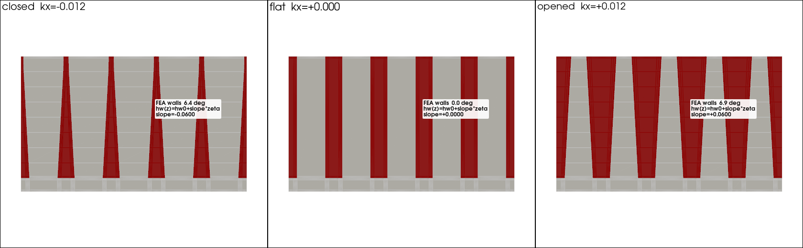

# Curved-panel RVEs — curvature-graded core properties

Grooved core panels are dry-laid into a (generally curved) mold, which **opens or
closes the grooves before infusion**. The infused core therefore has different
effective properties depending on where it sits on the mold. This example
homogenises that effect by keeping the RVE flat but **tapering the groove
geometry to a local mold curvature**, so the effective core tensor can be graded
along a curved panel.

## The model

A curvature `kx` / `ky` (1/mm; `kx` acts on the x-groove family, `ky` on the
y-family) tapers each groove. The walls rotate about the groove **root corner**:
blocks rotate `κ·p` per pitch `p`, so the mouth opens by `Δ = κ·p·depth` and the
half-width tapers linearly from nominal at the root to nominal+Δ at the mouth,
clamped to zero when a groove pinches shut. A single curvature opens grooves
mouthing on the convex face and closes those on the concave face. `κ = 0`
reproduces the flat (rectangular-groove) mesh exactly.

```json
{ "xgr": [[10, 10, -27, 3]], "curvature": {"kx": 0.004, "ky": 0.0}, "backend": "mfem" }
```

or from the CLI: `uv run b3core run --xgr="10,10,-27,3" --kx=0.004 --backend mfem`



*Base RVE viewed along y (orthographic): deep x-grooves run nearly through the
30 mm core; they flare toward the top surface when opened (`kx>0`) and pinch when
closed (`kx<0`).*

## Running

Requires the optional MFEM stack (`uv sync --extra mfem`):

```bash
uv run python examples/curved_panel/sweep.py        # κ → graded properties table
uv run python examples/curved_panel/render.py       # the image above (-> img/)
uv run python examples/curved_panel/curve_field.py  # κ(s) along a panel -> property field
```

Solver artefacts go under `out/` (gitignored); the renders are committed in `img/`.

For a unified study that adds thickness and groove-pattern sweeps plus matplotlib
response curves, see [`param_sweeps/`](../param_sweeps/).

## Representative geometry

The grooves run **nearly through the core**, leaving only a ~3 mm foam ligament
at the bottom — the hinge the grooves open/close about. `base.json` uses a 30 mm
core with `depth = thickness − 3 = 27` (top-mouth, so the depth entry is `−27`).
Keep the 3 mm floor for other cores: **25 mm → −22, 50 mm → −47**. Pitch 10,
width 3, PVC foam infused with epoxy.

## Sweep: properties vs curvature

Moduli in **GPa**.

| kx [1/mm] | R [mm] | state | resin_vf | rho_inf | Exx | Eyy | Ezz | Gxy |
|----------:|-------:|:-----:|---------:|--------:|----:|----:|----:|----:|
| −0.0080 | 125 | closed | 0.2345 | 334 | 0.2128 | 0.8032 | 0.5280 | 0.0672 |
| −0.0040 | 250 | closed | 0.3055 | 405 | 0.2360 | 1.0069 | 0.6422 | 0.0735 |
| +0.0000 | flat | — | 0.3420 | 442 | 0.2505 | 1.1117 | 0.7107 | 0.0776 |
| +0.0040 | 250 | open | 0.3906 | 491 | 0.2731 | 1.2512 | 0.7251 | 0.0849 |
| +0.0080 | 125 | open | 0.4392 | 539 | 0.3017 | 1.3907 | 0.7511 | 0.0942 |

Because the grooves are deep, curvature moves a lot of resin: opening lifts
`resin_vf` 0.23 → 0.44 and every modulus rises monotonically. The channels run
along y, so `Eyy` responds most strongly (0.80 → 1.39 GPa, ~73%), and `Ezz` now
grades strongly too (0.53 → 0.75) since the resin columns reach nearly through
the thickness. Closing pinches the grooves back toward the ungrooved foam.

## Curve → field: grading along a panel

`curve_field.py` takes a curvature distribution `kx(s) = κ_max·sin(π·s/L)` along
a panel (flat at the ends, most curved mid-span), builds and solves the RVE at
each station, and reports the effective field — the "piecewise approx a given
curve" deliverable a downstream shell/laminate model would sample.

| station | s [mm] | kx [1/mm] | R [mm] | resin_vf | Eyy | Ezz |
|--------:|-------:|----------:|-------:|---------:|----:|----:|
| 0 | 0 | +0.0000 | flat | 0.3420 | 1.1117 | 0.7107 |
| 1 | 83 | +0.0040 | 250 | 0.3906 | 1.2512 | 0.7251 |
| 2 | 167 | +0.0069 | 144 | 0.4262 | 1.3533 | 0.7434 |
| 3 | 250 | +0.0080 | 125 | 0.4392 | 1.3907 | 0.7511 |
| 4 | 333 | +0.0069 | 144 | 0.4262 | 1.3533 | 0.7434 |
| 5 | 417 | +0.0040 | 250 | 0.3906 | 1.2512 | 0.7251 |
| 6 | 500 | +0.0000 | flat | 0.3420 | 1.1117 | 0.7107 |

`resin_vf` and `Eyy` peak mid-span where the mold opens the grooves widest and
return to the flat values at the panel ends.

## Notes / limitations

- The RVE stays **flat** by design — only the groove widths taper; the
  macroscopic bend itself is not meshed (a downstream model applies it).
- Over-closed grooves clamp to zero width (solid foam); contact/interpenetration
  of the pinched foam walls is not modelled.
- Taper is approximated on the structured grid by cell-centre marking, so fine
  in-plane/through-thickness features stair-step; the moduli here are
  mesh-convergent at this resolution (verified coarse-vs-fine), but sharper
  groove corners would benefit from local refinement (see the MFEM AMR note).
