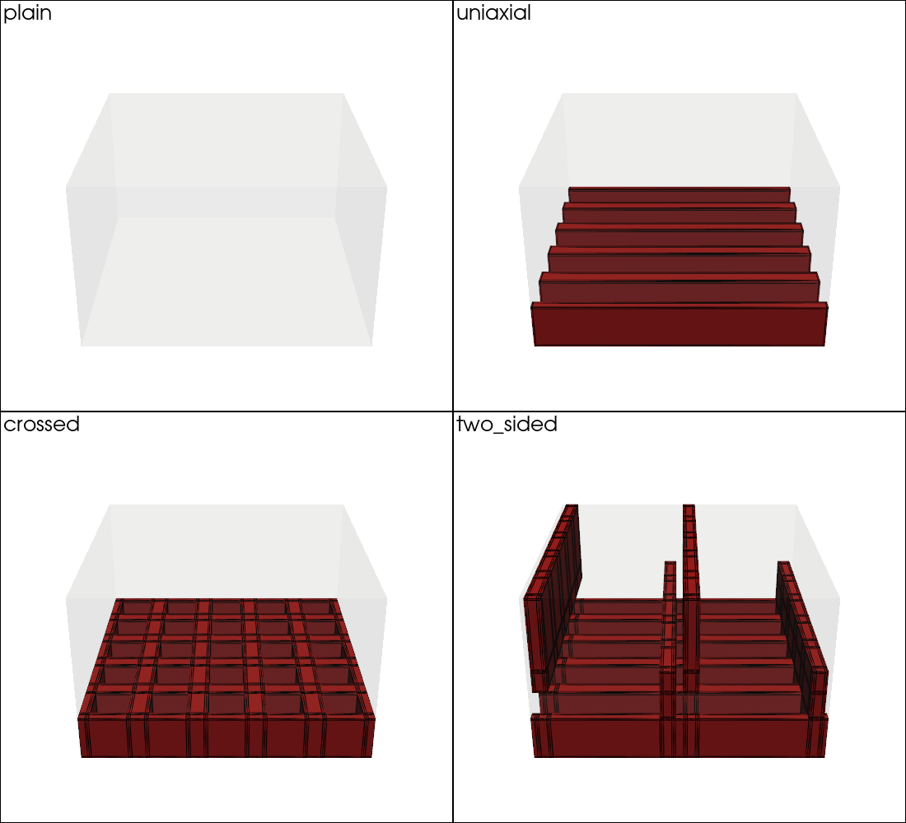
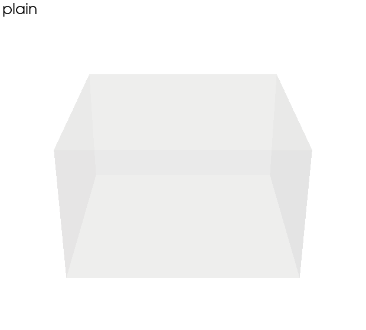
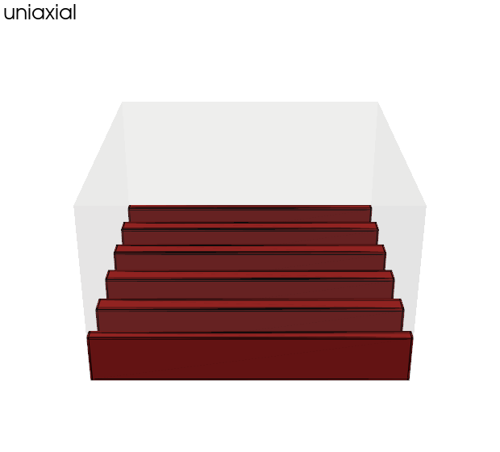
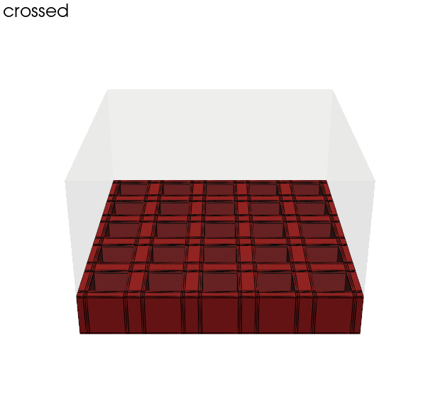
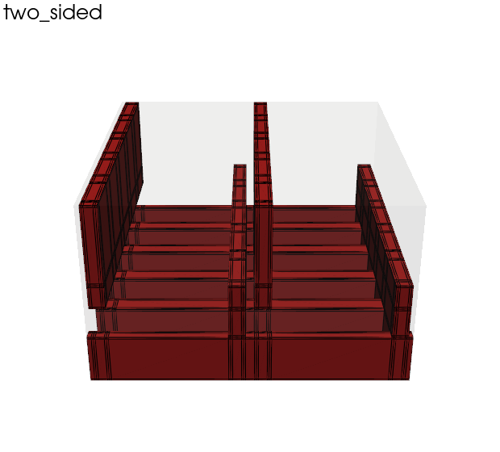
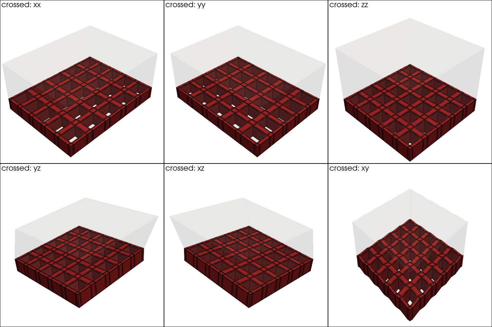
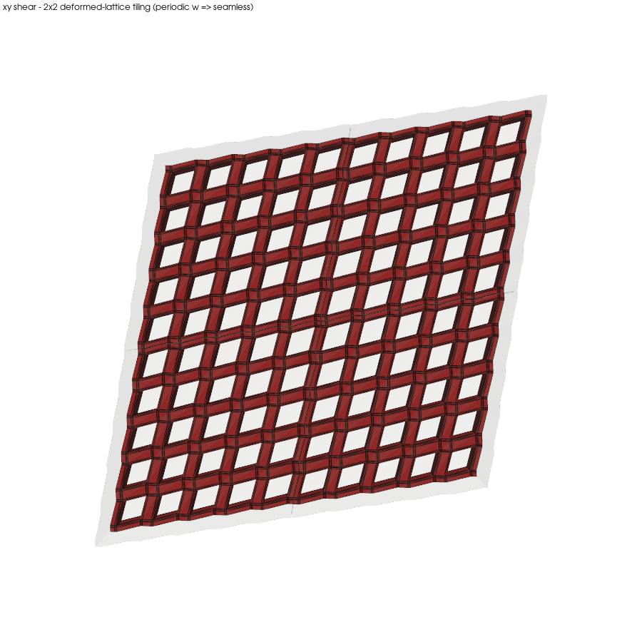

# MFEM backend — groove-pattern gallery

A small gallery that demonstrates the **MFEM periodic-BC homogenisation backend**
(`backend: "mfem"`) across a range of groove topologies, and cross-checks every
result against CalculiX.

Each case is a **bare (skinless) RVE solved with full 3D periodicity** — the
proper unit cell for extracting an effective *core material* tensor. Each sets
`backend: "mfem"` and `validate_with_ccx: true`, so a single run solves the six
unit-strain load cases with MFEM's true periodic boundary conditions *and*
re-solves them with CCX's reference-node engineering-strain MPCs, attaching a
per-property comparison to the output JSON.

## Running

Requires the optional MFEM stack and CalculiX on `PATH`:

```bash
uv sync --extra mfem          # installs PyMFEM (CPU-only, pip-installable)
uv run python examples/mfem_patterns/compare.py
```

The runner writes each case's artefacts under `out/<name>/` (gitignored) and
prints the table below. It exits non-zero if any case diverges from CCX beyond
`rtol = 0.05`.

For a unified parametric study with thickness and curvature sweeps plus matplotlib
response curves and gallery renders, see [`param_sweeps/`](../param_sweeps/).

## The patterns

| File | grooves | what it shows |
|------|---------|---------------|
| `plain.json` | none | Homogeneous core — MFEM must recover the isotropic input tensor exactly. Correctness anchor. |
| `uniaxial.json` | one x-family | Single channel direction → in-plane **orthotropy** (`Exx ≠ Eyy`). |
| `crossed.json` | symmetric x + y | Square in-plane symmetry → `Exx ≈ Eyy`, higher resin fraction. |
| `two_sided.json` | x + opposite-sign deep y | Top-down and bottom-up y-channels meet mid-core → **through-thickness** reinforcement, highest `Ezz`. |

## Gallery

Translucent foam core with the infused resin channels solid (`uv run python
examples/mfem_patterns/render.py`):



| | |
|---|---|
|  |  |
|  |  |

`plain` is bare foam (no channels); `uniaxial` is a set of parallel ribs;
`crossed` is the biaxial grid; `two_sided` shows the deep opposing y-walls that
reach through the thickness alongside the shallow x-channels.

## Deformed shapes & periodicity check

`deformed.py` warps the RVE by the true periodic displacement `u = E·x + w`
recovered from the MFEM correctors (`uv run python
examples/mfem_patterns/deformed.py crossed`). The six unit-strain modes:



To review that the periodic BC is actually enforced, the xy-shear cell is tiled
2×2 by the **deformed** lattice vectors. Because the fluctuation `w` is periodic,
the tiles abut seamlessly — the resin grid runs continuously across every tile
boundary with no gap or overlap:



(The test suite asserts the same invariant numerically: `w` on opposite faces
matches to <1e-9.)

## Results

Effective moduli in **GPa**; `CCX err` is the worst per-property MFEM-vs-CCX
relative error. Core = 0.13 GPa foam, resin = 3.0 GPa epoxy.

| pattern | resin_vf | area_inc | rho_inf | Exx | Eyy | Ezz | Gxy | Gxz | Gyz | CCX err |
|---------|---------:|---------:|--------:|----:|----:|----:|----:|----:|----:|--------:|
| plain     | 0.000 | 1.00 | 100 | 0.130 | 0.130 | 0.130 | 0.050 | 0.050 | 0.050 | 0.0% ✓ |
| uniaxial  | 0.096 | 1.80 | 196 | 0.173 | 0.406 | 0.187 | 0.063 | 0.059 | 0.065 | 0.0% ✓ |
| crossed   | 0.157 | 2.02 | 257 | 0.482 | 0.482 | 0.206 | 0.126 | 0.066 | 0.066 | 0.0% ✓ |
| two_sided | 0.204 | 2.96 | 304 | 0.524 | 0.463 | 0.396 | 0.084 | 0.145 | 0.086 | 0.0% ✓ |

Reading the rows:

- **plain** recovers `Exx = Eyy = Ezz = 0.130 GPa` and all `nu = 0.30` to <1e-3 —
  on a periodic mesh of a homogeneous medium the corrector load vanishes, so the
  input tensor comes straight back. This is the invariant the MFEM unit tests
  also check.
- **uniaxial** stiffens `Eyy` (0.406) far above `Exx` (0.173): the `xgr` slots
  run along *y*, so the resin columns carry `y` load.
- **crossed** restores `Exx = Eyy` (0.482) — the symmetric grid is
  square-symmetric in-plane.
- **two_sided** has the highest `Ezz` (0.396) and `Gxz` (0.145): the opposing
  deep y-families form a near-continuous resin column through the thickness.
- All four cases agree with CCX to **0.0%** — true-PBC (MFEM) and
  engineering-strain MPC (CCX) give the same volume-averaged tensor for a
  genuinely periodic medium.

## Note — these RVEs carry no skins

The gallery deliberately homogenises the **bare core**. Effective core moduli
(e.g. the through-thickness `Ezz`) are intrinsic properties of the periodic
microstructure, so the clean way to extract them is full 3D periodicity on a
skinless RVE — which is also why every case here agrees with CCX exactly.

Face plates belong to the *structure*, not the core material: a faced flatwise
pull measures a test (the stiff skins suppress in-plane contraction at the
bonded faces, giving a constrained modulus between `Ezz` and the oedometric
`C₃₃`), not a property. Build the panel model from this bare-core orthotropic
card plus skin plies and let that assembly apply the real skin constraint.
