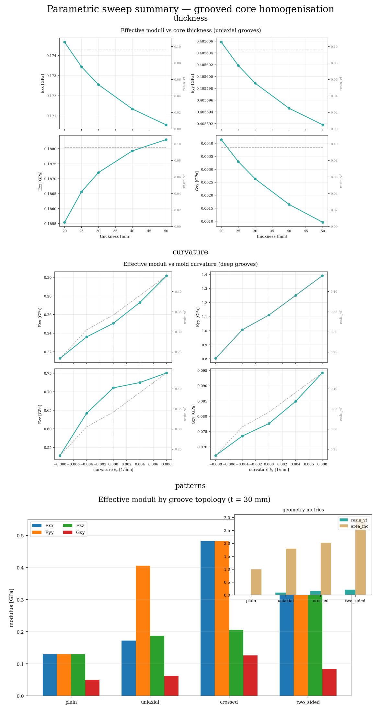
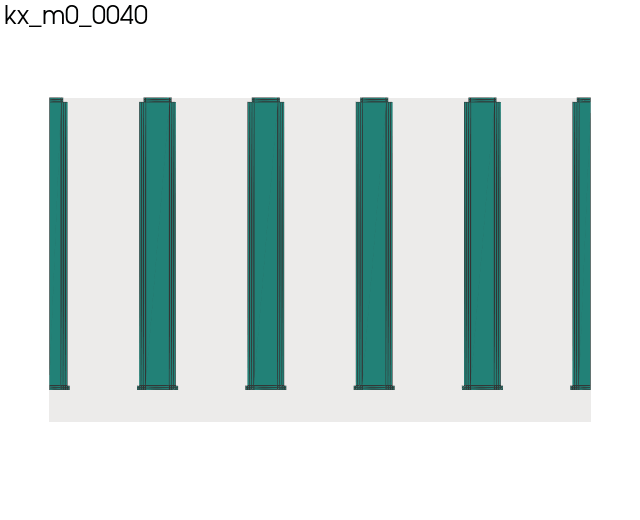

# Parametric sweeps — thickness, curvature, groove patterns

Unified homogenisation study across three RVE parameters, with publication
response curves and 3D gallery renders.

## Running

Requires MFEM (`uv sync --extra mfem`). Pattern sweep also needs CalculiX on PATH.

```bash
b3_core sweep homogenise --root examples/param_sweeps
# or: make sweep
```

Stages: `thickness`, `curvature`, `patterns`, `homogenise` (chain).

Response curves, gallery renders, GIFs: `examples/offline/` (`sweep_full.py`, `sweep_gifs.py`).

GIF export and full offline pipeline: [`examples/offline/`](../offline/README.md).

Solver artefacts go under `out/` (gitignored). Committed figures live in `img/`.





## Sweeps

| Script | Varies | Base geometry |
|--------|--------|---------------|
| `sweep_thickness.py` | 20, 25, 30, 40, 50 mm | Uniaxial grooves; depth scales as 8·t/30 |
| `sweep_curvature.py` | kx ∈ {−0.008, −0.004, 0, +0.004, +0.008} | Deep curved-panel grooves (3 mm ligament) |
| `sweep_patterns.py` | four groove topologies | Fixed 30 mm flat panel |

## Outputs

**Response curves** (`plot_responses.py`):

- `img/thickness_response.png` — moduli vs thickness
- `img/curvature_response.png` — moduli vs kx
- `img/patterns_comparison.png` — grouped bar chart per pattern
- `img/sweep_summary.png` — vertical stack of the three above

**Geometry** (`render.py`):

- `img/thickness_strip.png`, `img/curvature_strip.png`, `img/patterns_gallery.png`
- `img/galleries/gallery_*.png` — 6-panel `GroovedCoreView` boards

**GIFs** (offline only — `examples/offline/sweep_gifs.py`):

- `img/thickness.gif`, `img/curvature.gif`, `img/patterns.gif` — geometry sweep loops
- `img/thickness_response.gif`, `img/curvature_response.gif` — animated response curves
- `img/galleries.gif` — cycles through the publication gallery boards

## Related examples

- [`curved_panel/`](../curved_panel/) — focused curvature demo (table + strip render)
- [`mfem_patterns/`](../mfem_patterns/) — groove-pattern gallery + CCX validation